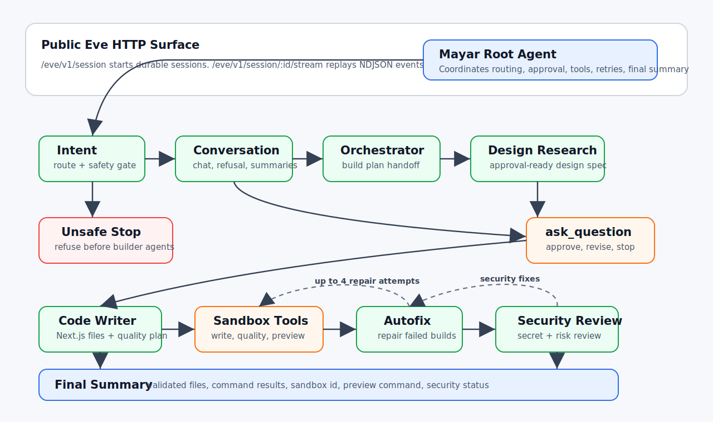

# Mayar Eve Builder

Mayar is a standalone Eve-powered AI app and website builder. It is designed as a comparison implementation for the existing NestJS `jaxagentsdk` pipeline while leaving that codebase untouched.

Mayar accepts normal chat and build prompts through Eve's built-in durable session API. For build prompts, it coordinates specialist subagents, pauses for design approval, writes generated Next.js projects into an Eve sandbox, validates them, runs an autofix loop when needed, performs a security review, and returns a final build summary.



## What Mayar Builds

Mayar v1 focuses on generated web applications:

- Next.js
- TypeScript
- App Router
- Bun as the generated app package manager
- Local sandbox validation before final summary
- Optional Unsplash image discovery
- Optional InsForge server-only placeholders for generated backend code

Mayar does not modify `jaxagentsdk`. It lives as its own Eve project and can be deployed, tested, or evolved independently.

## Architecture

Eve is filesystem-first. Mayar follows that model:

```text
agent/
├── agent.ts                     # root agent config
├── instructions.md              # root orchestration prompt
├── channels/
│   └── eve.ts                   # public Eve channel entrypoint
├── lib/
│   ├── model.ts                 # role-based model config
│   ├── sandbox.ts               # shared sandbox helpers
│   └── schemas.ts               # shared Zod schema definitions
├── sandbox/
│   └── sandbox.ts               # Eve defaultBackend sandbox config
├── subagents/
│   ├── intent/
│   ├── conversation/
│   ├── orchestrator/
│   ├── design_research/
│   ├── code_writer/
│   ├── autofix/
│   └── security_review/
└── tools/
    ├── write_generated_files.ts
    ├── run_quality_commands.ts
    ├── start_preview.ts
    ├── bash.ts                  # disabled broad shell tool
    └── write_file.ts            # disabled broad file tool
```

### Runtime flow

1. A client starts a session with `POST /eve/v1/session`.
2. The root agent calls `intent` first.
3. Unsafe requests stop immediately and receive a refusal through `conversation`.
4. Normal chat routes to `conversation`.
5. Build requests route to `orchestrator`.
6. `design_research` creates an approval-ready plan.
7. The root agent calls Eve's built-in `ask_question` tool.
8. If approved, `code_writer` generates a project file set and quality plan.
9. `write_generated_files` writes files under `/workspace/generated-app`.
10. `run_quality_commands` runs finite commands only.
11. `autofix` repairs failed builds and validation issues, up to the configured retry limit.
12. `start_preview` starts the preview process and returns sandbox metadata.
13. `security_review` checks the generated app before final response.
14. `conversation` writes the final user-facing summary.

### Why subagent calls use `message` only

Eve exposes declared subagents as tools with this shape:

```ts
{
  message: string;
  outputSchema?: object;
}
```

During local testing with the current Eve/provider stack, valid JSON text from child sessions was rejected when the root passed `outputSchema`. Mayar therefore keeps typed Zod schemas in `agent/lib/schemas.ts` for developers, but the root instructs subagents to return plain JSON text through the `message` path. This keeps the durable subagent pipeline stable while preserving typed schema documentation.

## Multi-Model Setup

Mayar mirrors the `jaxagentsdk` strategy of using lighter models for routing and stronger models for design/code/security work.

Defaults:

| Role | Environment Variable | Default Model |
| --- | --- | --- |
| Root | `MAYAR_ROOT_MODEL` | `openai/gpt-5.4-mini` |
| Intent | `INTENT_AGENT_MODEL` | `openai/gpt-5.4-mini` |
| Orchestrator | `ORCHESTRATOR_AGENT_MODEL` | `openai/gpt-5.4-mini` |
| Design Research | `DESIGN_RESEARCH_AGENT_MODEL` | `openai/gpt-5.5` |
| Code Writer | `CODE_WRITER_AGENT_MODEL` | `openai/gpt-5.5` |
| Autofix | `AUTOFIX_AGENT_MODEL` | `openai/gpt-5.5` |
| Security Review | `SECURITY_REVIEW_AGENT_MODEL` | `openai/gpt-5.5` |
| Conversation | `CONVERSATION_AGENT_MODEL` | `openai/gpt-5.4-mini` |

Use Vercel AI Gateway model ids, including provider prefixes such as `openai/gpt-5.5`.

## Environment

Copy `.env.example` to `.env.local` and fill in the values you need.

Required for model calls:

```bash
AI_GATEWAY_API_KEY=...
```

Optional:

```bash
UNSPLASH_ACCESS_KEY=...
UNSPLASH_API_BASE_URL=https://api.unsplash.com
INSFORGE_API_BASE_URL=...
INSFORGE_API_KEY=...
```

Do not put real secrets into generated apps. Mayar treats InsForge values as server-only placeholders and never writes real credentials into generated source files or `.env.local`.

## Install

Requirements:

- Node.js `>=24 <27`
- pnpm `11.5.0`

```bash
pnpm install --frozen-lockfile
```

## Local Development

Run the Eve dev server:

```bash
pnpm run dev
```

The local Eve HTTP API is available at:

```text
http://127.0.0.1:2000/eve/v1/session
```

Start a session:

```bash
curl -X POST http://127.0.0.1:2000/eve/v1/session \
  -H "content-type: application/json" \
  -d '{"message":"build a simple one-page portfolio site for a photographer"}'
```

Stream a session:

```bash
curl -N http://127.0.0.1:2000/eve/v1/session/<sessionId>/stream
```

If local Eve dev reports a stale workflow cache after edits, clear generated artifacts and restart:

```bash
rm -rf .eve .output
pnpm run dev
```

## Validation

Run the same checks used by CI:

```bash
pnpm run ci
```

Individual commands:

```bash
pnpm run audit
pnpm run typecheck
pnpm run build
pnpm run smoke
```

`pnpm run build` performs Eve discovery and compiles the project. `pnpm run smoke` checks the expected project structure, release version, model environment mapping, and subagent-call discipline.

## CI

The GitHub Actions CI workflow is in `.github/workflows/ci.yml`.

It runs:

- `audit`: critical production dependency audit
- `validate`: typecheck and static smoke checks
- `build`: Eve production build
- `full-ci`: the complete `pnpm run ci` command

CI intentionally does not run live model sessions because those require protected AI Gateway credentials and can incur usage. Live smoke testing should be run locally or in a protected environment.

## Releases

The release workflow is in `.github/workflows/release.yml`.

It supports:

- automatic releases when tags matching `v*` are pushed
- manual `workflow_dispatch` releases
- environment-specific packages: `development`, `staging`, or `production`
- source archive generation through `scripts/package-release.sh`
- GitHub release creation or update

Create a production release locally:

```bash
git tag v1.0.0
git push origin v1.0.0
```

The workflow will package and publish the release artifact. The v1.0.0 release notes live at `docs/releases/v1.0.0.md`.

## Developer Extension Points

### Add or tune a subagent

Each declared subagent lives under `agent/subagents/<name>/`. Update its `instructions.md` for behavior and `agent.ts` for model routing or description changes.

### Add a local tool

Add a typed Eve tool under `agent/tools/`. Keep root tools narrow and avoid broad filesystem or shell access unless they are intentionally scoped and safe.

### Adjust generated app validation

Update `agent/tools/run_quality_commands.ts` and the quality-plan schema in `agent/lib/schemas.ts`.

### Add preview URL support

Mayar v1 returns sandbox id, preview command, and port. If Eve exposes a preview URL resolver in a later version, add a small adapter around `start_preview` rather than changing the rest of the pipeline.

## Security Model

- Unsafe prompts are refused before builder subagents run.
- Broad `bash` and `write_file` tools are disabled.
- Generated files are constrained to `/workspace/generated-app`.
- File paths are validated as safe relative paths.
- Quality commands are finite.
- Preview/server commands are separated from validation commands.
- Real secrets must not be written into generated apps.
- InsForge values are server-only placeholders.
- Security review runs after sandbox validation and before final response.

## Version

Current release: `1.0.0`.
