# Eveable

Eveable is an open-source alternative to Lovable built on Vercel Eve. It turns a prompt into a complete Next.js application, validates it in an Eve sandbox, starts a live preview, runs a security review, deploys to Vercel, and returns a verified deployment URL.

Eveable began as a standalone Eve-powered implementation of the existing `jaxagentsdk` builder pipeline. The NestJS `jaxagentsdk` remains untouched, so developers can compare the original architecture with a filesystem-first Eve implementation.

## Why Eveable

- **Built on Vercel Eve:** durable sessions, streamable runs, subagents, tools, human approval, and sandbox access come from Eve.
- **Real builder pipeline:** Eveable does not stop after writing files. It validates, previews, reviews, deploys, and verifies.
- **Open architecture:** each specialist is a folder under `agent/subagents/`, each integration is a typed Eve tool under `agent/tools/`.
- **Sandbox-first generation:** generated projects are written to `/workspace/generated-app`, not into the repository.
- **Vercel deployment:** validated apps are deployed through `deploy_to_vercel` when `VERCEL_TOKEN` is configured.

## Current Version

Current release: `1.0.0`

The v1 release includes root orchestration, seven declared subagents, typed shared schemas, sandbox validation, preview health checks, Vercel deployment, CI, release packaging, and smoke tests.

## Architecture

Eve is filesystem-first: an agent is a directory of instructions, tools, channels, sandbox config, shared code, and subagents. Eveable follows that shape closely.

```mermaid
flowchart LR
  User["Client or Eve TUI"] --> Session["/eve/v1/session"]
  Session --> Stream["/eve/v1/session/:id/stream"]
  Session --> Root["Eveable Root Agent"]

  Root --> Intent["intent subagent"]
  Intent -->|"conversation"| Conversation["conversation subagent"]
  Intent -->|"unsafe"| Refusal["conversation refusal"]
  Intent -->|"build or edit"| Orchestrator["orchestrator subagent"]

  Orchestrator --> Design["design_research subagent"]
  Design --> Approval["ask_question approval checkpoint"]
  Approval -->|"Revise design"| Design
  Approval -->|"Stop"| Conversation
  Approval -->|"Approve and build"| CodeWriter["code_writer subagent"]

  CodeWriter --> WriteFiles["write_generated_files tool"]
  WriteFiles --> Quality["run_quality_commands tool"]
  Quality -->|"failed"| Autofix["autofix subagent"]
  Autofix --> WriteFiles
  Quality -->|"passed"| Preview["start_preview tool"]
  Preview -->|"failed"| Autofix
  Preview -->|"healthy"| Security["security_review subagent"]
  Security -->|"needs fixes"| Autofix
  Security -->|"passed"| Deploy["deploy_to_vercel tool"]
  Deploy -->|"failed app issue"| Autofix
  Deploy -->|"missing Vercel config"| UserAction["user action required"]
  Deploy -->|"verified URL"| Final["conversation final summary"]
```



## Pipeline Guarantees

Eveable is intentionally strict about what counts as complete:

1. The root agent must call `intent` first for every user message.
2. Unsafe prompts are refused before builder subagents run.
3. Build prompts go through `orchestrator` and `design_research`.
4. Code generation pauses for user approval through Eve's `ask_question`.
5. Generated files are written only under `/workspace/generated-app`.
6. Finite quality commands run before any preview or deployment.
7. Build, preview, security, and deployment failures route through `autofix` when repairable.
8. A final "ready" or "deployed" response is allowed only after:
   - quality commands pass
   - preview health check passes
   - security review passes
   - Vercel deployment returns and verifies a URL

## Repository Layout

```text
.
├── agent/
│   ├── agent.ts
│   ├── instructions.md
│   ├── channels/
│   │   └── eve.ts
│   ├── lib/
│   │   ├── model.ts
│   │   ├── sandbox.ts
│   │   └── schemas.ts
│   ├── sandbox/
│   │   └── sandbox.ts
│   ├── subagents/
│   │   ├── autofix/
│   │   ├── code_writer/
│   │   ├── conversation/
│   │   ├── design_research/
│   │   ├── intent/
│   │   ├── orchestrator/
│   │   └── security_review/
│   └── tools/
│       ├── deploy_to_vercel.ts
│       ├── run_quality_commands.ts
│       ├── start_preview.ts
│       ├── write_generated_files.ts
│       ├── bash.ts
│       └── write_file.ts
├── scripts/
│   ├── package-release.sh
│   └── smoke.mjs
├── .github/workflows/
│   ├── ci.yml
│   └── release.yml
├── env.sample
├── CONTRIBUTING.md
├── SECURITY.md
└── README.md
```

## Key Files

| File | Purpose |
| --- | --- |
| `agent/instructions.md` | Root orchestration contract and completion rules. |
| `agent/agent.ts` | Root Eve model configuration. |
| `agent/lib/model.ts` | Role-based model selection through env vars. |
| `agent/lib/schemas.ts` | Zod schemas for structured handoffs and tool results. |
| `agent/lib/sandbox.ts` | Safe path handling, command normalization, redaction, and sandbox helpers. |
| `agent/sandbox/sandbox.ts` | Eve `defaultBackend()` sandbox setup. |
| `agent/channels/eve.ts` | Public Eve session/stream entrypoint. |
| `agent/tools/write_generated_files.ts` | Writes generated app files into `/workspace/generated-app`. |
| `agent/tools/run_quality_commands.ts` | Runs finite install/typecheck/build commands. |
| `agent/tools/start_preview.ts` | Starts preview and verifies HTTP health inside the sandbox. |
| `agent/tools/deploy_to_vercel.ts` | Deploys the generated app to Vercel and verifies the URL. |
| `scripts/smoke.mjs` | Static project-shape checks used by CI. |

## Subagents

| Subagent | Responsibility |
| --- | --- |
| `intent` | Classifies the request, rejects unsafe work, and chooses the next route. |
| `conversation` | Writes user-facing chat, refusals, approval summaries, and final summaries. |
| `orchestrator` | Converts a safe build request into a concise internal plan. |
| `design_research` | Produces the approval-ready design direction and implementation brief. |
| `code_writer` | Generates a full Next.js TypeScript App Router project. |
| `autofix` | Repairs generated files after build, preview, security, or deployment failures. |
| `security_review` | Reviews generated source for secrets, browser env leaks, and common web risks. |

## Tools

Eveable uses narrow local Eve tools instead of broad shell/file access:

| Tool | Scope |
| --- | --- |
| `write_generated_files` | Writes only safe relative paths under `/workspace/generated-app`. |
| `run_quality_commands` | Runs finite commands only. Preview/server commands are filtered out. |
| `start_preview` | Starts the generated app preview and probes `http://127.0.0.1:<port>`. |
| `deploy_to_vercel` | Runs Vercel CLI from the generated workspace and verifies the returned URL. |
| `search_unsplash_images` | CodeWriter-local image search using optional Unsplash credentials. |

`bash.ts` and `write_file.ts` are present as disabled broad tools. Keep them disabled unless you are intentionally changing the trust model.

## Generated Code Location

Generated applications are stored in the Eve sandbox:

```text
/workspace/generated-app
```

The generated code is not written into this repository. To inspect it, watch the Eve stream/dev TUI tool results for:

- `write_generated_files`
- `run_quality_commands`
- `start_preview`
- `deploy_to_vercel`

Those results include the `sandboxId`, `workspacePath`, generated file list, command results, preview port, and Vercel deployment URL.

## Requirements

- Node.js `>=24 <27`
- pnpm `11.5.0`
- Vercel Eve `0.11.4`
- Vercel CLI available locally or installable through `npx`

## Environment

Copy `env.sample` to `.env.local`:

```bash
cp env.sample .env.local
```

Minimum local model setup:

```bash
AI_GATEWAY_API_KEY=...
```

Deployment setup:

```bash
VERCEL_TOKEN=...
```

Optional deployment controls:

```bash
VERCEL_PROJECT_NAME=...
VERCEL_SCOPE=...
EVEABLE_DEPLOY_ENV_ALLOWLIST=...
```

Optional generation integrations:

```bash
UNSPLASH_ACCESS_KEY=...
UNSPLASH_API_BASE_URL=https://api.unsplash.com
INSFORGE_API_BASE_URL=...
INSFORGE_API_KEY=...
```

`EVEABLE_ROOT_MODEL` replaces the older `MAYAR_ROOT_MODEL`; the runtime still accepts `MAYAR_ROOT_MODEL` as a fallback. `EVEABLE_DEPLOY_ENV_ALLOWLIST` replaces `MAYAR_DEPLOY_ENV_ALLOWLIST`; that older key is also still accepted as a fallback.

Never commit real `.env.local` values. Generated apps must not receive real secrets in source files or generated `.env.local` files.

## Model Configuration

Eveable can use different models per role.

| Role | Env var | Default |
| --- | --- | --- |
| Root | `EVEABLE_ROOT_MODEL` | `openai/gpt-5.4-mini` |
| Intent | `INTENT_AGENT_MODEL` | `openai/gpt-5.4-mini` |
| Orchestrator | `ORCHESTRATOR_AGENT_MODEL` | `openai/gpt-5.4-mini` |
| Design Research | `DESIGN_RESEARCH_AGENT_MODEL` | `openai/gpt-5.5` |
| Code Writer | `CODE_WRITER_AGENT_MODEL` | `openai/gpt-5.5` |
| Autofix | `AUTOFIX_AGENT_MODEL` | `openai/gpt-5.5` |
| Security Review | `SECURITY_REVIEW_AGENT_MODEL` | `openai/gpt-5.5` |
| Conversation | `CONVERSATION_AGENT_MODEL` | `openai/gpt-5.4-mini` |

Use Vercel AI Gateway model ids, including provider prefixes such as `openai/gpt-5.5`.

## Install

```bash
pnpm install --frozen-lockfile
```

## Run Locally

Start Eve:

```bash
pnpm run dev
```

The local Eve API is available at:

```text
http://127.0.0.1:2000/eve/v1/session
```

Start a session:

```bash
curl -X POST http://127.0.0.1:2000/eve/v1/session \
  -H "content-type: application/json" \
  -d '{"message":"build a one-page landing page for a boutique analytics studio"}'
```

Stream a session:

```bash
curl -N http://127.0.0.1:2000/eve/v1/session/<sessionId>/stream
```

If Eve dev reports stale workflow cache errors after edits, restart with a clean cache:

```bash
rm -rf .eve .output
pnpm run dev
```

The `dev` script already clears `.eve` and `.output` before launching.

## Test And Validate

Run everything CI runs:

```bash
pnpm run ci
```

Individual commands:

```bash
pnpm run audit
pnpm run typecheck
pnpm run build
pnpm run smoke
```

What they do:

- `audit`: critical production dependency audit
- `typecheck`: TypeScript validation with `tsgo`
- `build`: Eve discovery and production build
- `smoke`: static checks for expected files, model env mapping, and subagent-call discipline
- `ci`: audit, typecheck, build, and smoke

## Deployment Behavior

Generated app deployment happens from inside the Eve sandbox:

1. `deploy_to_vercel` runs in `/workspace/generated-app`.
2. It uses `VERCEL_TOKEN` from the Eveable runtime environment.
3. It passes selected server-only env vars through Vercel CLI `-e` and `-b` flags.
4. It parses the Vercel deployment URL.
5. It verifies the URL with `vercel curl`.

If `VERCEL_TOKEN` is missing, Eveable reports a blocked deployment with the exact configuration required. It does not invent deployment URLs.

## Release Notes

### v1.0.0

- Introduced Eveable as an Eve-powered alternative to Lovable.
- Added durable session entrypoint through `/eve/v1/session` and `/eve/v1/session/:sessionId/stream`.
- Added multi-agent pipeline: intent, conversation, orchestrator, design research, code writer, autofix, and security review.
- Added human approval checkpoint before code generation through Eve's built-in `ask_question`.
- Added sandbox-first generated app writes under `/workspace/generated-app`.
- Added finite quality command validation, preview startup, preview health check, security review, Vercel deployment, and URL verification.
- Added role-based model selection with environment overrides.
- Added CI and release workflows for audit, typecheck, Eve build, smoke checks, packaging, artifact upload, and GitHub releases.

## Release Workflow

The release workflow lives in `.github/workflows/release.yml`.

It supports:

- automatic releases when tags matching `v*` are pushed
- manual `workflow_dispatch` releases
- environment-specific packages: `development`, `staging`, or `production`
- source archive generation through `scripts/package-release.sh`
- GitHub release creation or update

Create a production release locally:

```bash
git tag v1.0.0
git push origin v1.0.0
```

The workflow packages the repository and uses this README as the release notes source.

## Contributing

Read `CONTRIBUTING.md` before opening issues or pull requests.

Good first contribution areas:

- improve generated app quality plans
- add safer deployment adapters
- improve design research guidance
- add tests around sandbox command normalization
- improve documentation for live Eve sessions

## Security

Read `SECURITY.md` before reporting vulnerabilities.

Important security expectations:

- never commit secrets
- never write real secrets into generated apps
- keep generated files constrained to `/workspace/generated-app`
- keep broad shell/file tools disabled by default
- treat deployment and external side effects as sensitive

## Known Limitations

- Eve is in preview, so public APIs can change.
- Live agent testing requires model credentials and can incur usage.
- Eveable intentionally keeps generated apps inside the sandbox unless the Vercel deployment tool succeeds.
- The current Eve/provider combination has had issues with optional subagent `outputSchema` in this workflow, so Eveable keeps shared Zod schemas for developers while asking subagents for JSON text through `message`.

## License

MIT. See `LICENSE`.
